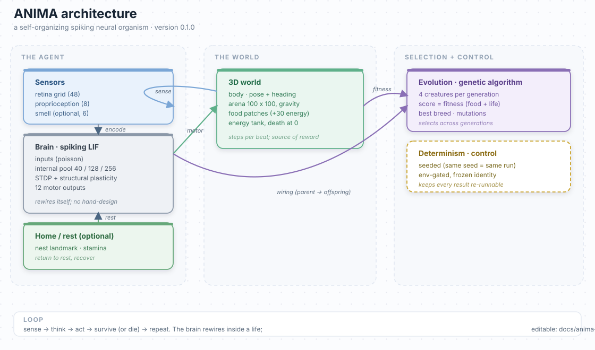

# ANIMA

> **A developmental artificial nervous system that forages.** A spiking LIF network receives
> retinal/proprioceptive frames from a physical 3D body in an arena and controls it to find and
> consume food, written from scratch in Rust, with no hand-designed internal architecture, no
> pretrained models, and no external memory modules.

<div align="center">

**Read the friendly, from-the-start white paper**

**[docs/white-paper.md](docs/white-paper.md)** is a research story in plain language: what we built,
every idea explained, our wins and our honest failures, and the two walls we measured. Every exact
number you need to re-run the experiments is in the appendix at the end.

</div>

---

## What is this?

ANIMA is an attempt to grow, rather than build, an intelligent agent. We fix only the boundaries:
sensory inputs in, motor outputs out, a physical world, a survival rule, and fundamental plasticity
laws. The network organizes its own internals. The work follows laboratory discipline: every
experiment is env-gated (identity-safe), deterministic, and pre-registered before it runs.

This repository is a **frozen research artifact (v0.1.0)**. It documents what we demonstrated, what
we could not demonstrate, and why, with measured evidence rather than claims.

## Current status

**Demonstrated**

- developmental / self-organizing spiking neural network (no hand-designed internals, no pretrained
  models, no external memory modules)
- 3D embodiment: a body with position, heading (yaw), pitch, velocity, and motor output
- sensory input: retina, proprioception, optional food smell
- food acquisition, energy, and death dynamics
- persistent food-patch foraging (`SL2_STASIS`; 3 to 36 meals per life)
- long survival under a difficulty ladder (up to 2,230 beats)
- home / rest behavior on the seeds that evolved it (reward-gated, seed-fragile)
- deterministic reproducibility: seeded randomness, frozen identity line

**Not yet demonstrated**

- robust selective continual learning (blocked by internal-band saturation)
- open-ended evolutionary improvement (fitness economy saturates once food is reachable)
- escaping the measured fitness ceiling
- general intelligence, or biological equivalence

These are measured limits, not hidden defects. The white paper covers each of them in detail.

## Architecture



The editable source is a native draw.io file: [`docs/anima-architecture.drawio`](docs/anima-architecture.drawio)
(open it in the draw.io app or view it on the GitHub file page). The loop is sense, think, act,
survive or die, repeat. The brain changes its own wiring (STDP) inside a life, and the population
changes across generations (mutation and selection).

## Getting started

```bash
cargo build --release -p anima-world --bin world_survival

# Frozen default-identity check (must print exactly):
./target/release/world_survival 20260924 77 60
#   WL2 RESULT beats=60 died_at=none final_energy=40.0 food_touches=0 novel_flags=0

cargo test --workspace        # 198 tests, 0 failures
```

Every feature is a switch you put in front of the command. For example, stable food:
`SL2_STASIS=1 ./target/release/world_survival --explore --smell 20260924 77 60`.

## Key ideas

| Idea | Detail |
|---|---|
| Self-organization | STDP + structural plasticity grow the topology; no hand-designed internals |
| Env-gated experiments | every mechanism is a `SL2_*` / `WL2_*` switch; unset means byte-identical baseline |
| Determinism | seeded RNG, no `HashMap` iteration order; same args + env gives identical runs |
| Reward = food only | steering is the action, never rewarded directly (charter) |

## Selected mechanisms (env-gated)

| Gate | Mechanism | Status |
|---|---|---|
| `SL2_STASIS` | stable food + re-entry guard + tank cap | Verified: 3 to 36 meals/life |
| `SL2_HMEXP` | hunger-modulated search (settle-when-fed) | Verified |
| `SL2_NEST` / `SL2_NESTFIT` | home second-drive + homing reward | Verified on seed 7; seed-fragile |
| `SL2_RSTDPP` | dopamine-gated STDP (three-factor) | Measured: fires, non-selective under saturation |
| `SL2_NOVELTY` | minimal-criterion novelty selection | Measured: steers, ceiling unchanged |
| `SL2_MB` | mushroom-body expansion + input-locus plasticity | Unproven: awaits de-saturation |
| `SL2_IINH/THETA/AMPL/HET` | de-saturation campaign | Measured negative on all four levers |

## The two walls (short version)

1. **Internal-band neural saturation.** The internal layer fires at 100% every tick, so every
   reward-gated learning rule is a non-selective global wash the GA ignores. We probed competition,
   threshold, input amplitude, and per-neuron heterogeneity, all bounded negative; the band is
   temporally bistable (cold to sparse, then a sharp phase transition to saturated).
2. **Fitness-economy ceiling.** Evolution pins at a scoring-family value: roughly 121.8 / 121.0
   under plain survival scoring, 137.5 to 137.6 under the density / ARS scoring families, and 179.4
   under the homing family (that last one includes the +40-per-return bonus and is not an escape).
   In every case the survival-plus-meals core saturates once food is reachable.

Both are explained, with the measured evidence and the exact constants, in the
[white paper](docs/white-paper.md).

## Repository layout

```
crates/anima-core/        spiking network core (LIF, STDP, structural plasticity)
crates/anima-world/       the 3D world, the organism, the experiment binary
crates/anima-exp/         evolutionary / experiment helpers
crates/anima-viz/         live viewer
crates/anima-telemetry/   run recording and analysis
scripts/                  config and protocol generators
configs/                  experiment configuration files
docs/white-paper.md       the white paper
docs/anima-architecture.drawio  architecture diagram (this README)
experiments/              index of experiment protocols and results
research/                 index of research lineage and corrections
paper/                    older manuscript lineage (separate)
```

## Reading the research

- [White paper](docs/white-paper.md): the story, the walls, and the reproduction appendix.
- [Experiment index](experiments/README.md): protocols and results by experiment family.
- [Research lineage](research/README.md) and [corrections](research/corrections.md): how the
  project was constrained by experiment over time, including failed hypotheses.
- [Source](crates/anima-world/src/bin/world_survival.rs): the organism and experiments.
- [Reproducibility](docs/white-paper.md#13-appendix-every-number-explained): commands, seeds, gates.

## Reproducibility & discipline

Every claim in the white paper is backed by a deterministic run and verifiable from this repo:
frozen identity line, two-run determinism diff, 198-test suite, and env-gated observability probes
(`KCPROBE`, `SW_PROBE`, `MB_PROBE`, `NEST_PROBE`). The [reproducibility appendix](docs/white-paper.md#13-appendix-every-number-explained)
lists every constant and command.

## Citation and license

- Citation: see [CITATION.cff](CITATION.cff).
- Version: 0.1.0 (this release).
- License: [MIT](LICENSE). The dependencies are standard MIT/Apache/BSD crates; the figures in
  `paper/` are generated in-repo. No incompatible third-party assets require separate handling.